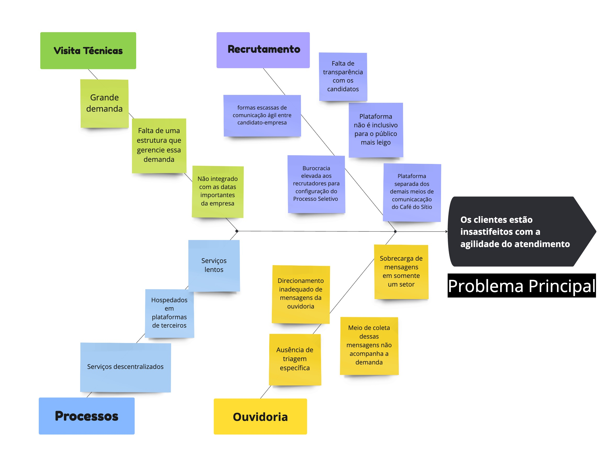

# 1. Cenário Atual do Cliente e do Negócio

## 1.1 Introdução ao Negócio e Contexto

    

            O Café do Sítio é uma empresa tradicional no setor de alimentos e bebidas,
        especializada na produção e comercialização de café de alta qualidade. Com décadas
        de história no mercado, a marca se consolidou como referência no segmento,
        atendendo desde consumidores finais até grandes redes de varejo. Além do foco na
        produção sustentável e de excelência, a empresa se preocupa em oferecer um
        relacionamento mais próximo com seus clientes e parceiros de negócios, refletindo
        seus valores de tradição e confiança.
    

    

            Há algum tempo, o Café do Sítio tem ampliado sua presença digital, buscando
        otimizar seus processos de atendimento e fortalecer o relacionamento com seus
        clientes. O público-alvo da empresa inclui consumidores de café premium,
        distribuidores, lojistas e parceiros comerciais. No entanto, com o crescimento das
        operações, surgiram desafios relacionados à gestão do atendimento ao cliente, que se
        tornou descentralizado e ineficiente. 
    

## 1.2. Identificação da Oportunidade ou Problema

    

                A principal dor identificada no Café do Sítio está relacionada à falta de
    agilidade de atendimento ao cliente, isto é, por conta de cada serviços de atendimento
    ao cliente utiliza de um meio diferente a depender de sua categoria: Para
    recrutamento, o café do sítio utiliza o software "empregare" para coletar os currículos
    e organizar o processo recrutador. Além disso, para reclamações a empresa utiliza o
    email, telefone e as redes sociais para capturar esse dados. Para o rastreamento de
    produtos, a empresa também compartilha do meio telefônico. Por fim, para
    agendamento de visitas técnicas é utilizado o Whatsapp, Redes Sociais, Email e
    Telefone. O ponto é que, por utilizarem de diversas plataformas, o Café do Sítio sente
    dificuldade na gestão dessas informações e no acompanhamento de solicitações, tal
    como foi informado pela própria empresa cliente: Muitas solicitações acabam se
    perdendo no caminho e não chegam nos setores responsáveis, em vista disso, muitos
    clientes acabam ligando novamente ao Café do Sítio buscando por transparência, mas
    os processos não possuem o registro das fases em que estão.

    

        Atualmente, os diferentes canais de atendimento da empresa não estão
    integrados, elucidados pelo Café do Sítio quando informou que todos os serviços
    envolvendo o cliente é cuidado apenas pelo setor de marketing, que deve enviar as
    demandas aos setores mais adequados para resolverem os problemas com essas
    pessoas quando, na realidade, o sistema poderia ser integrado à todos os setores da
    empresa para que o departamento adequado seja notificado em tempo real, além das
    diversas plataformas a serem analisados pelo Marketing para serem organizados e
    transferidos aos departamentos, que se torna desgastante. Em resumo, os processos
    atuais do Café do Sítio resultam em problemas como demora na resposta, perda de
    informações importantes e uma experiência distinta para cada cliente, isto é, mesmo
    que 2 clientes tenham a mesma solicitação, o processo não possui a mesma agilidade e
    qualidade na resposta. Esses fatores afetam negativamente tanto a satisfação do
    consumidor quanto a eficiência interna dos setores envolvidos (Setor de Marketing,
    Setor de Tecnologia da Informação e Setor de Recursos Humanos) ou seja, na forma
    como as demandas são passadas de um setor ao outro e como elas possuem
    transparência com relação ao status do processo, cujo são escassas no atual momento.
    

    

   
 

 

Figura 1: Diagrama espinha de peixe apresentando causas e problemas identificados pela
equipe frente ao depoimento do cliente

##1.3 - Desafios do Projeto

 *Falta de Integração de Sistemas:*

    

        Atualmente, a Família do Sítio utiliza o sistema de recrutamento Empregare, por onde recebem currículos e realizam processos seletivos. Utiliza emails, telefonemas e redes sociais para receber feedbacks de seus clientes. E carece de um gestor de visitas presencias à fábrica, sendo essas organizadas por telefone e contatos. Sendo assim, os sistemas da Empregare, da ouvidoria e da gestão de visitas não estão integrados e há uma dificuldade na gestão desses contatos com o cliente que vem de diversas fontes, o que acaba por sobrecarregar o setor de Marketing, que acaba por ter que gerenciar essas solicitações. Por conta disso, acontece de solicitações vindas dos clientes não chegarem no setor responsável para lidar com tal solicitação. Além disso, os processos não possuem um registro da fase em que estão. Portanto, clientes podem ter experiências em que um cliente obteve suporte a sua solicitação, enquanto outro cliente não a obteve por causa de como o gerenciamento dessas solicitações está sendo feito.
    

*Problemas com o Sistema de Recrutamento (Empregare):*

    

    O sistema terceirizado utilizado para o recrutamento já causou problemas, como falta de transparência nas informações passadas aos candidatos e dificuldades para os próprios recrutadores, como burocracia alta na configuração dos processos seletivos, demora na atualização das fases do processo recrutador. Além disso, os emails são enviados com certo atraso aos envolvidos neste processo, comprometendo a comunicação e impactando negativamente a imagem da empresa. Por fim, o Café do Sítio informou que a plataforma, para o caso deles, não se mostra totalmente acessível para um público mais leigo que não costuma utilizar aparelhos tecnológicos (Celular, computador, Tablets) frequentemente.
    

*Sobrecarga e Falta de Automação no Atendimento:* 

    

    O sistema atual de   atendimento às reclamações, agendamentos de visitas técnicas, e rastreamento de produtos da empresa é feito por telefone e email, e portanto, dificultando a coleta destes dados pela equipe de Marketing, o único setor encarregado para estas questões.
    

*Risco à Imagem da Empresa:*

    

    Os problemas relacionados ao sistema de recrutamento, o recebimento de feedback e reclamações pelos clientes via email, telefonemas e redes sociais e à forma como é feito o agendamento de visitas físicas causa uma descentralização no atendimento podem prejudicar a imagem do Café do Sítio perante seus clientes e parceiros, criando uma percepção de ineficiência e falta de inovação, evidenciada pela dificuldade de seleção no recrutamento de pessoal e do recebimento de mensagens de clientes em setores opostos ao assunto abordado na mensagem.
    

##1.4 - Segmentação de Clientes

    

        A princípio, foram identificados 3 grupos. O primeiro grupo consiste nos consumidores finais, geralmente pessoas entre 25 e 50 anos, que buscam café de qualidade para consumo próprio. Esses clientes prezam pela praticidade no atendimento e pela disponibilização de informações sobre produtos, como rastreamento de em qual unidade café do sítio é possível encontrar determinados pedidos e suporte pós-compra.
    

    

        O Outro segmento é composto por parceiros comerciais e distribuidores, que variam entre 35 e 60 anos, adquirem os produtos do Café do Sítio para revenda ou distribuição em larga escala. Para esse público, a eficiência na logística e a clareza nas comunicações são essenciais, como um painel ou atualização regular via e-mail com informações sobre o estoque atual e datas previstas para novos lotes, enviar notificações automatizadas em cada etapa do pedido, desde a confirmação de compra até o envio e entrega ou um cronograma visual de campanhas promocionais, com informações sobre descontos futuros e lançamentos, facilita o planejamento para compras em volume e amplia as oportunidades de vendas, especialmente em relação ao rastreamento de produtos e suporte técnico. Eles exigem um atendimento mais estruturado e ágil, assim um software estruturado pode oferecer um portal para registro e acompanhamento de solicitações priorizadas, uma base de conhecimento para autoatendimento, e relatórios automáticos com métricas e feedback. Essas funcionalidades garantem suporte ágil e transparente para parceiros e distribuidores e assim, proporcionando essa melhora do atendimento.
    

    

        Por fim, outro grupo associado ao recrutamento, em sua maioria entre 14 e 40 anos, representa uma fatia menor dos clientes do Café do Sítio, com candidatos e profissionais em busca de oportunidades de trabalho na empresa. Este segmento representa apenas um público que também utiliza dos serviços de comunicação com a empresa.
    

---

## Historico de Versão
Data     | Versão | Descrição | Autor | Revisores 
-------- | ------ | --------- | ----- | ---------
06/11/2024 | 0.2 | Tópicos 1.3 e 1.4 | Arthur Suares | João Pedro
07/11/2024 | 0.3 | Tópicos 1.1 e 1.2 | Ana Carolina | Daniel